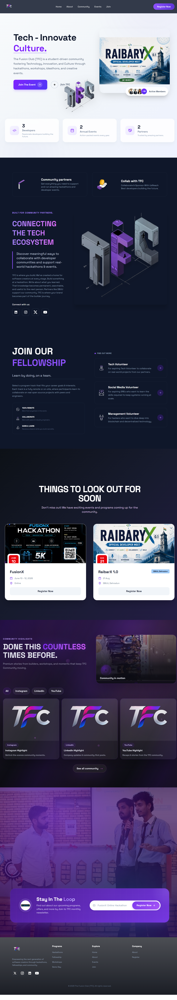
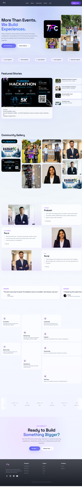

# The Fusion Club Website

Official website of **The Fusion Club**.


# Fusion Starter

A production-ready full-stack React application with integrated Express server, featuring React Router 6 SPA mode, TypeScript, Vitest, Zod and modern tooling.

This project uses a React + Express architecture.

The Express server should only be used when backend functionality is required, such as authentication, database operations, API integrations, or handling sensitive credentials.

## Tech Stack

- **PNPM**: Prefer pnpm
- **Frontend**: React 18 + React Router 6 (spa) + TypeScript + Vite + TailwindCSS 3, plugins and animation + shadcn/ui style component set 
- **Backend**: Express server integrated with the Vite development server (currently includes only demo routes).
- **Testing**: Vitest
- **UI**: Radix UI + TailwindCSS 3 + Lucide React icons
- **Animations**: GSAP, Lenis, Framer Motion, Three.js, Lottie, DotLottie, Embla Carousel, Lordicon
- **Development**: Vite, Vitest, ESLint, Prettier

## Getting Started

### Clone the repository

```bash
git clone https://github.com/THE-FusionClub/Thefusionclub-website.git
cd Thefusionclub-website
```

### Install dependencies

**Recommended (pnpm)**

```bash
pnpm install
```

**Or using npm**

```bash
npm install
```

### Start the development server

**Using pnpm**

```bash
pnpm dev
```

**Or using npm**

```bash
npm run dev
```

After the server starts, open the local URL shown in your terminal (typically `http://localhost:5173`).

## Preview

[host at netlify with domain .xyz](https://thefusionclub.xyz/)



<!--  -->


## Project Structure

   Thefusionclub-website/
   ├─ README.md
   ├─ package.json
   ├─ vite.config.ts
   ├─ vite.config.server.ts
   ├─ index.html
   ├─ tsconfig.json
   ├─ tailwind.config.ts
   ├─ postcss.config.js
   ├─ eslint.config.js
   ├─ client/
   │  ├─ App.tsx
   │  ├─ global.css
   │  ├─ global-intro.css
   │  ├─ vite-env.d.ts (Provides Vite-specific TypeScript declarations.)
   │  ├─ assets/
   │  │  ├─ logo.png
   │  │  ├─ day-night.lottie  (removed)
   │  │  ├─ team.lottie
   │  │  ├─ M4iFOW10Xd.lottie (Animated shapes used in the Hero section of events page)
   │  │  └─ dragon/dragon.png
   │  ├─ components/
   │  │  ├─ animations/AnimatedCounter.tsx
   │  │  ├─ icons/LordiconSolid.tsx
   │  │  ├─ layout/
   │  │  │  ├─ Navbar/Navbar.tsx (+ Navbar.css)
   │  │  │  ├─ Footer/Footer.tsx (+ Footer.css)
   │  │  │  ├─ IntroCinematic/IntroCinematic.tsx (+ IntroCinematic.css)
   │  │  │  └─ DragonCursor/DragonCursor.tsx (+ DragonCursor.css)
   │  │  └─ shared/ScrollProgress.tsx
   │  ├─ components/ui/  (many Radix/shadcn-style UI primitives)
   │  ├─ hooks/
   │  │  ├─ use-mobile.tsx
   │  │  ├─ usePrefersReducedMotion.ts
   │  │  └─ use-toast.ts
   │  ├─ lib/utils.ts (+ utils.spec.ts)
   │  ├─ pages/
   │  │  ├─ Index.tsx
   │  │  ├─ NotFound.tsx
   │  │  ├─ Events.tsx
   │  │  ├─ About.tsx
   │  │  ├─ Community.tsx (+ Community.css)
   │  │  ├─ SignIn/SignIn.tsx (+ SignIn.css)
   │  │  ├─ SignUp/SignUp.tsx
   │  │  ├─ JoinEvent/JoinEvent.tsx (+ JoinEvent.css)
   │  │  ├─ home/
   │  │  │  └─ sections/ (HeroSection, FellowshipSection, EcosystemSection, etc.)
   │  │  ├─ about/
   │  │  │  ├─ About.tsx
   │  │  │  └─ sections/ (HeroSection, BentoSection, GallerySection, etc.)
   │  │  │  └─ components/ + hooks/
   │  │  ├─ community/
   │  │  │  ├─ Community.tsx
   │  │  │  └─ CommunityPage.tsx
   │  │  │  └─ sections/ (HeroSection, FeaturedStories, PartnersSection, etc.)
   │  │  └─ events/
   │  │     ├─ EventsPage.tsx
   │  │     ├─ data.ts
   │  │     ├─ Events.tsx
   │  │     └─ sections/ (HeroSection, UpcomingEvents, CTA, FeaturedEvent, etc.)
   │  └─ styles/animations.css
   │
   ├─ public/
   │  ├─ favicon.ico
   │  ├─ placeholder.svg
   │  └─ assets/
   │     ├─ logo.png, colored-logo.png
   │     ├─ community/ (L-1.png, L-2.png, idea-1.jpg, trip-1.jpeg)
   │     ├─ events/ (fusionX.png, fusionXposter.png, RaibarX.png)
   │     ├─ partners-logo/ (dbuu.png, kailshians.png)
   │     └─ team-mates/ (ishita.jpg, om.png, parul.png, prakash.jpeg, shreya.jpg, suraj.jpeg)
   │
   └─ server/
      ├─ index.ts
      ├─ node-build.ts
      └─ routes/
         └─ demo.ts


## License

This project is licensed under the MIT License. See the [LICENSE](LICENSE) file for details.

## Attribution

Animated icons by **[Lordicon](https://lordicon.com/)**.


## Notes for Future Developers

### Lordicon

Please do not remove the Lordicon attribution. It is required under their licensing terms.

### Initial Repository

The initial commits were rewritten because additional tooling (such as ESLint) was added before the project was finalized.

If you have any questions regarding the original project setup, feel free to contact me.


## resolved bug


